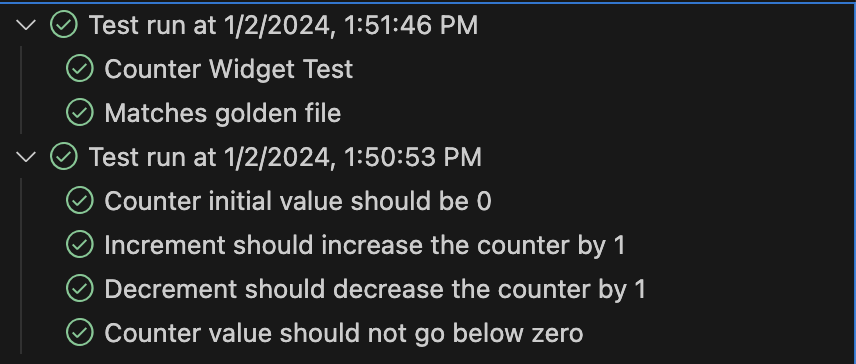
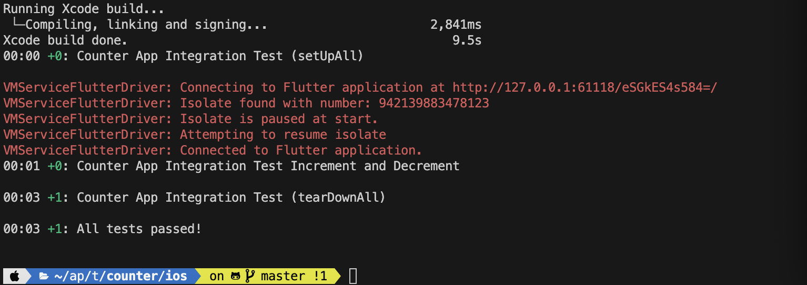
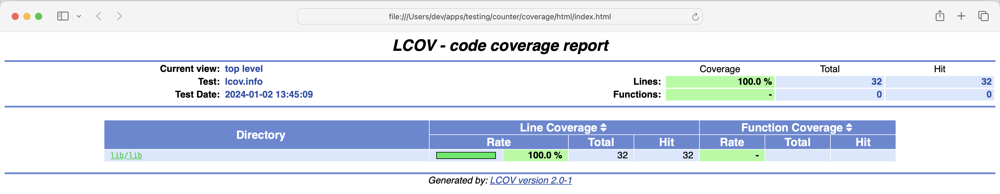

# Overview

The Counter App is a simple Flutter application that allows users to increment and decrement a counter value. It serves as a basic example for understanding Flutter app development and state management.

## Features

- Increment and decrement buttons for modifying the counter value.
- Display of the current counter value.

## Installation
1. Clone the repository:
   ```
   git clone https://github.com/queendevelopers/flutter-counter-example-with-test.git
   ```
5. Navigate to the project directory: 
   ```
   cd counter
   ```
7. Install dependencies
   ```
   flutter pub get
   ```
9. Run the app flutter run
   ```
   flutter run
   ```

## Project files
- **main.dart:** counter application
- **counter.dart:** increment and decrement method
- **.vscode/launch.json:** vscode launch configuration for application, unit test, widget test and integration test.
- **test/unit/counter_test:** unit test.
- **test/wiget/counter_widget_test:** widget & golden test
- **test_driver:** integration test and screenshot extension method.
- **.github:** configuration for codemagic.
- **coverage:** generated codecoverage from lcov.





## Code coverage
- We have 100% code coverage for counter application (also demonstrates ignore file for main function). You can open code coverage page by using command on root for the project :
  ```
  open coverage/html/index.html
  ```


## Codemagic 
- Codemagic setup is required to work the github continuos integration and deployment.
- If you manage to setup on your personal repo then check Run only test and Android. (iOS build won't work util you add certificates)
- Also, for flutter integration test arguments, you need to replace with following command:
  ```
  driver --target=test_driver/main_app.dart --driver=test_driver/main_app_test.dart
  ```


